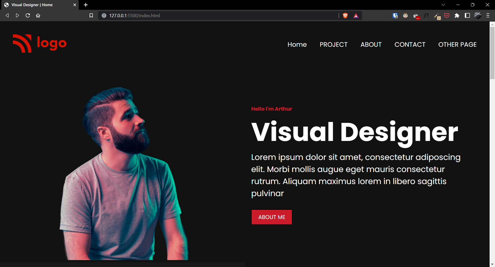
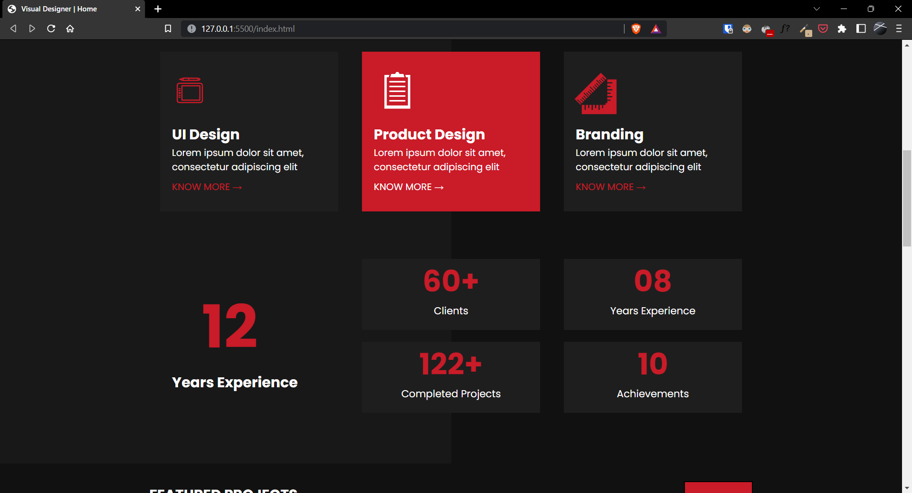
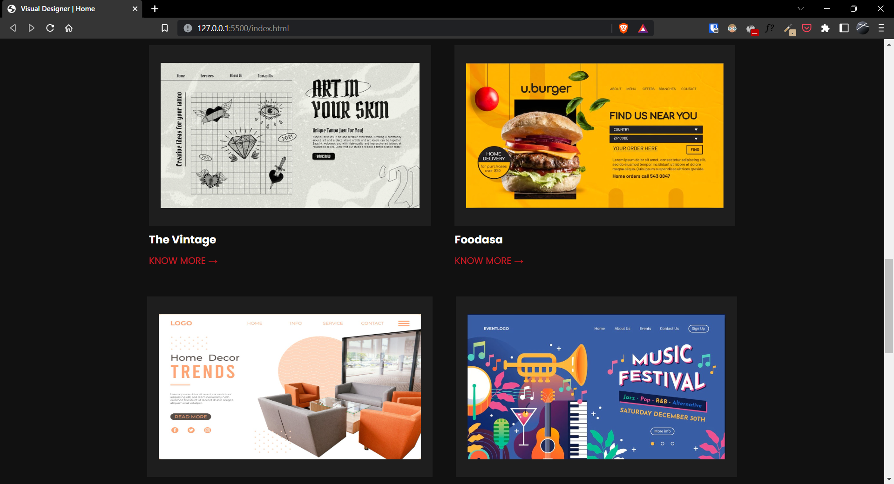
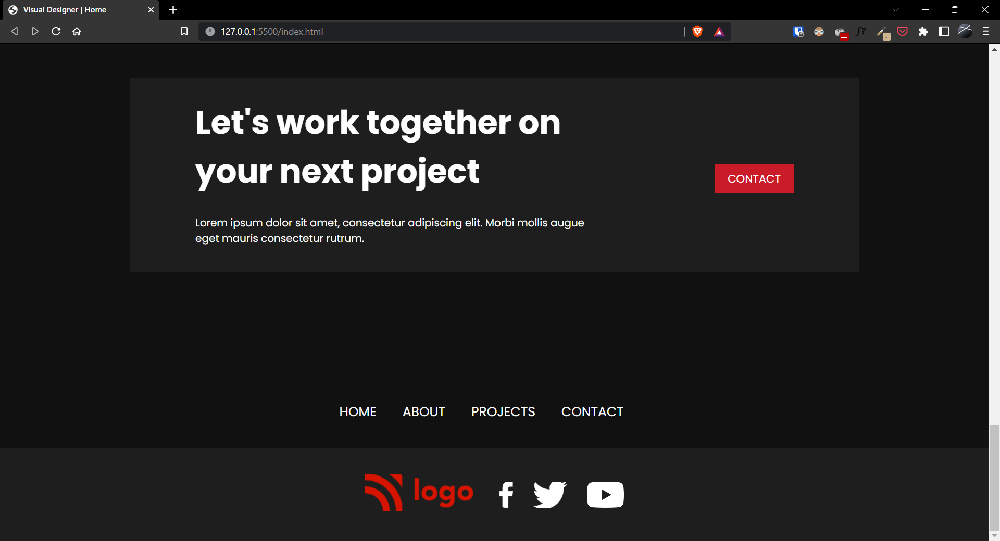

# Project-15 | Visual Designer Home Page

Hi there,
I'm Wasit Ali and this is my 15th project on HTML and CSS.

## 🖥 Preview

🚀 [Live Preview](https://funny-crepe-13e14b.netlify.app/)

## 🛠️ What I have learned in this project?

- Css flexbox and its property usecase.
- Used cards of different sizes.
- Learnt about z-index usecase.
- Handled mobile Responsive With Media Queries.

## ⏲ Time taken to finish the project

- About 2 days in total.
